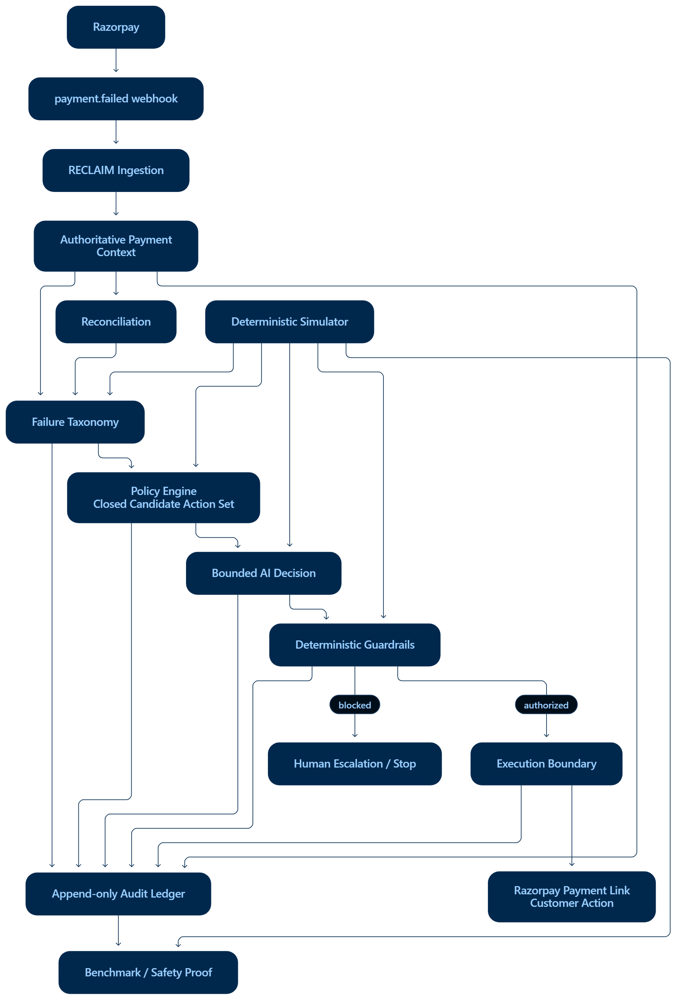
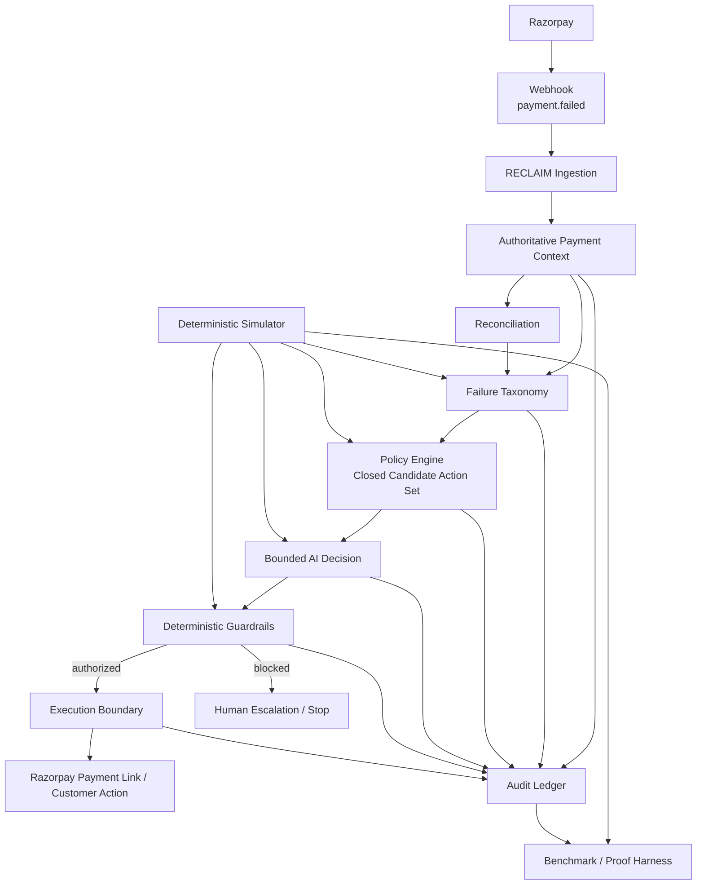

# RECLAIM

### Autonomous Payment Recovery Control Plane

**Razorpay Buildathon · Track 03 — AI Revenue Recovery**

> **AI recommends. Policy constrains. Guardrails authorize. Every decision is auditable.**

RECLAIM is an event-driven payment recovery control plane built around a simple idea:

**a failed payment should become a controlled recovery decision, not an automatic blind retry.**

The system takes a failed payment, determines why it failed, builds a **closed set of policy-approved recovery actions**, uses bounded AI to select the most appropriate action from that set, validates the recommendation through deterministic guardrails, and records the decision in an inspectable audit ledger.

When the authorized action is customer-facing recovery, RECLAIM can create a **real Razorpay Payment Link in Test Mode** rather than performing an uncontrolled server-side re-charge.

---

## Live Demo

**Production:** [RECLAIM](https://reclaim-ten-umber.vercel.app/)

**Repository:** [GitHub Repository](https://github.com/arsingh693/RECLAIM)

---

# 1. Why RECLAIM exists

Payment failure is not one problem.

An account may simply be out of funds. A bank may be temporarily unavailable. A card may be expired. A risk system may have blocked the transaction. A gateway may have timed out without telling the merchant whether money actually moved.

A fixed retry ladder treats these failures as if they were identical.

RECLAIM treats them as different states with different safe recovery strategies.

| Failure condition | Naive response | RECLAIM response |
|---|---|---|
| Insufficient funds | Retry on a fixed schedule | Consider timing/context before retrying |
| Expired / invalid instrument | Retry the same instrument | Request an instrument update |
| Issuer unavailable | Keep retrying later | Use an issuer-aware recovery policy |
| Gateway timeout | Retry and hope | **Reconcile before any new charge** |
| Risk block | Try another route around the block | Stop or escalate to a human |
| Mandate ceiling exceeded | Retry blindly | Respect the authorization boundary |

The important engineering question is not simply:

> **“Can AI recover more payments?”**

It is:

> **“Where should AI be allowed to make a decision, and where must code remain authoritative?”**

RECLAIM is designed around that boundary.

---

# 2. The core idea

RECLAIM deliberately splits authority.

### Deterministic code decides what is permitted

The policy layer owns:

- failure classification
- the closed catalog of recovery interventions
- retry and attempt limits
- reconciliation requirements
- customer-contact restrictions
- dispute/risk constraints
- mandate ceilings
- terminal / stop conditions

These are business and safety constraints.

They are not delegated to a language model.

### AI decides what is best among permitted options

The AI receives:

- payment context
- the classified failure
- the policy-approved candidate actions
- relevant customer/recovery context

It can choose **one of those actions** and provide reasoning.

It cannot:

- invent a new intervention
- widen the candidate set
- raise an attempt ceiling
- bypass a risk restriction
- bypass a mandate limit
- bypass reconciliation
- directly become the payment executor

### Guardrails decide whether the recommendation is executable

The selected intervention is evaluated again.

If it violates a deterministic rule, RECLAIM **fails closed**:

```text
AI recommendation
      ↓
Guardrail evaluation
      ↓
AUTHORIZED ─────────→ execution boundary
      │
      └──────────────→ BLOCKED / human escalation
```

That separation is the central design decision of the project.

---

# 3. How this maps to the Buildathon track

**Selected track:** Track 03 — **AI Revenue Recovery**

The track asks for a system that can identify revenue at risk, reason about an appropriate intervention, and recover revenue through an actual workflow.

RECLAIM implements that as a payment-recovery control plane:

```text
Failed payment
      ↓
Understand why it failed
      ↓
Generate safe recovery options
      ↓
Use AI to choose among those options
      ↓
Apply deterministic safety constraints
      ↓
Execute an authorized recovery action
      ↓
Record the complete decision trail
```

This makes the project more than an “AI retry bot.”

It is a **bounded decision system around money-moving operations**.

---

# 4. Architecture

The high-level architecture is included as a visual artifact in the repository:



### Architecture at a glance



### Gateway abstraction

The recovery engine is designed behind a gateway boundary:

```text
PaymentGateway
├── SimulatedGateway
│   └── deterministic / seeded benchmark
└── RazorpayGateway
    └── Razorpay Test Mode integration
```

The simulator exists because a benchmark needs reproducibility.

The Razorpay adapter exists because the integration needs to be real.

Those are different jobs, so they are kept separate.

---

# 5. What broke at 2 AM

Building a financial recovery system exposed a more interesting problem than simply making the UI work.

The failures that mattered most were **contract and control-boundary failures**.

The engineering loop became:

```text
Measure it.
   ↓
Trace it.
   ↓
Fix it.
   ↓
Re-run it.
```

### 01 — Recovery console crashed on a valid response

The recovery API returned a wrapped result object while the UI expected the decision payload at the top level.

The backend decision was valid.

The interface contract was not aligned.

**Fix:** make the API/UI response contract explicit and update the recovery console to consume the authoritative `result` payload.

---

### 02 — The verification script was reading an old response shape

The recovery implementation had evolved, but the proof script was still expecting an older nested payload.

That meant the system could be correct while the verification tooling was wrong.

**Fix:** update the proof harness to validate the current flat recovery result and its actual audit artifacts.

This reinforced an important principle:

> **Verification code is part of the system, not an afterthought.**

---

### 03 — AI provenance and authority boundaries became stricter

An early implementation attempted to expose more provider metadata directly through the decision result.

That created unnecessary type coupling.

More importantly, it blurred the distinction between:

```text
AI recommendation
```

and:

```text
system authority
```

**Fix:** keep provenance explicit through the existing decision source model and keep policy + guardrails authoritative.

The model can recommend.

It cannot authorize.

---

### 04 — Deterministic proof was re-run after the lifecycle fix

The final deterministic proof run covered:

```text
100 payments
177 decisions
92 attempts
```

The run recovered:

```text
₹37,985.50
```

with:

```text
0 AI fallbacks
```

The adversarial safety assertions also passed.

---

### 05 — The real gateway path was then proved

The system was connected to Razorpay Test Mode and the real recovery lifecycle was exercised:

```text
Razorpay failed payment
        ↓
Authoritative payment retrieval
        ↓
Failure classification
        ↓
Policy-approved candidates
        ↓
Bounded AI recommendation
        ↓
Deterministic guardrails
        ↓
Razorpay recovery link
        ↓
Audit ledger
```

This is the final outcome of the engineering loop:

> **The system did not just recover in simulation. The real gateway integration reached the recovery boundary safely.**

---

# 6. End-to-end recovery flow

A typical RECLAIM evaluation looks like this.

### 01 — Gateway state

RECLAIM receives or fetches the authoritative Razorpay payment state.

### 02 — Failure taxonomy

The gateway failure is mapped into the RECLAIM decline taxonomy.

Examples include:

```text
INSUFFICIENT_FUNDS
ISSUER_UNAVAILABLE
GATEWAY_TIMEOUT
RISK_BLOCKED
MANDATE_LIMIT_EXCEEDED
DO_NOT_HONOUR
CARD_EXPIRED
CARD_BLOCKED
INVALID_INSTRUMENT
AUTHENTICATION_FAILED
```

The taxonomy is not merely descriptive.

It determines the safety boundary.

### 03 — Candidate generation

The policy engine generates a **closed candidate set**.

For example:

```text
RETRY_SCHEDULED
RETRY_ALTERNATE_RAIL
ESCALATE_HUMAN
STOP_PERMANENT
```

The important property is:

> **The AI never receives authority outside the candidate set.**

### 04 — Bounded AI recommendation

The AI chooses among the policy-approved candidates.

In the current demo environment, a deterministic development provider is used so behavior remains reproducible while preserving the same decision boundary expected from an AI-backed provider.

### 05 — Guardrail evaluation

The recommendation is checked against deterministic constraints.

The result is:

```text
AUTHORIZED
```

or:

```text
BLOCKED
```

### 06 — Execution boundary

RECLAIM intentionally separates **authorization** from **execution**.

An authorized customer-facing recovery can result in a real Razorpay Payment Link.

The customer then completes the payment through Razorpay.

### 07 — Audit

The evaluation is recorded in the ledger, including decision context, guardrail outcome, event identity, timestamps, and recovery artifacts.

---

# 7. Reconciliation is a first-class safety rule

One of the most important decisions in RECLAIM is how it handles a gateway timeout.

A timeout does **not** necessarily mean:

> “the payment failed.”

It can mean:

> “the system does not yet know what happened.”

That distinction matters because a blind retry after an ambiguous outcome can result in a duplicate charge.

RECLAIM therefore treats an indeterminate gateway state as a **reconciliation problem first**.

Conceptually:

```text
GATEWAY_TIMEOUT
      ↓
No new charge
      ↓
Reconcile authoritative state
      ↓
┌───────────────────────────┐
│ already captured?         │ → stop
│ definitively failed?      │ → reclassify + re-decide
│ still unknown?            │ → remain conservative
└───────────────────────────┘
```

This changes the state model itself rather than merely adding another warning.

---

# 8. Safety architecture

RECLAIM is deliberately fail-closed.

The system includes deterministic protections around:

- candidate-action containment
- AI confidence validation
- execution authorization
- open-dispute restrictions
- risk restrictions
- retry / attempt ceilings
- gateway timeout reconciliation
- mandate ceilings
- terminal stop conditions

The adversarial safety suite verifies properties such as:

```text
✓ candidate actions remain inside taxonomy
✓ AI cannot widen the action space
✓ invalid AI confidence is rejected
✓ non-charge decisions cannot reach the gateway
✓ open disputes block money movement
✓ risk blocks cannot be bypassed through another rail
✓ attempt ceilings cannot be exceeded
✓ gateway timeouts require reconciliation
✓ mandate ceilings protect authorization boundaries
```

These are not UI assertions.

They are system-level invariants.

---

# 9. Real Razorpay integration

RECLAIM is connected to Razorpay **Test Mode** for the live integration path.

The project verifies:

- Razorpay API authentication
- real Test Mode order creation
- Razorpay Checkout
- payment verification using HMAC
- failed payment retrieval
- `payment.failed` webhook ingestion
- webhook signature verification
- event identity / duplicate-event protection
- real Payment Link creation
- recovery gateway references
- audit recording

The live recovery path demonstrated during development was:

```text
Real failed Razorpay payment
        ↓
RECLAIM fetches authoritative state
        ↓
Failure taxonomy
        ↓
Policy candidates
        ↓
Bounded decision
        ↓
Guardrails
        ↓
Razorpay Payment Link
        ↓
Audit ledger
```

### Important execution boundary

RECLAIM does **not** claim unrestricted autonomous production card charging.

The current integration deliberately demonstrates **customer-action recovery through Razorpay Test Mode**, with authorization and execution separated.

That is an intentional safety boundary.

---

# 10. Recovery Console

The web UI provides an operator-facing recovery console where a reviewer can enter a real Razorpay payment ID and inspect the recovery decision boundary.

The console exposes:

- payment state
- decline classification
- candidate actions
- selected intervention
- decision source
- confidence
- guardrail result
- execution boundary
- recovery artifact
- decision reasoning
- recovery trace

This turns the system from a black-box “AI demo” into an inspectable payment-operations tool.

---

# 11. Decision Simulator

The UI also contains a deterministic simulator for failure scenarios such as:

```text
Insufficient funds
Issuer unavailable
Gateway timeout
Risk blocked
Mandate limit exceeded
```

A run exposes the internal path rather than only the final answer:

```text
Policy
   ↓
AI recommendation
   ↓
Guardrails
   ↓
Execution boundary
   ↓
Audit
```

This makes the system useful for both demonstrations and reproducible validation.

---

# 12. Audit Ledger

Every important recovery decision leaves an inspectable event trail.

Typical events include:

```text
RECOVERY_EVALUATED
RECOVERY_BLOCKED
RECOVERY_LINK_CREATED
RECOVERY_LINK_FAILED
```

The ledger captures enough context to answer:

- Which payment was evaluated?
- What failure was detected?
- Which actions were permitted?
- Which intervention was selected?
- Was the decision AI-sourced or fallback?
- Did guardrails allow it?
- What happened at the execution boundary?
- Was a recovery link created?
- What gateway reference was produced?

The UI exposes event identity and allows deeper event details to be inspected.

---

# 13. Deterministic benchmark

A payment-recovery system needs a benchmark that can be reproduced.

RECLAIM therefore maintains a deterministic, seeded simulator for measurement.

The current benchmark compares the same seeded payment population using two strategies.

### Current benchmark result

| Metric | Fixed retry baseline | RECLAIM |
|---|---:|---:|
| Recovery rate | **15.50%** | **18.51%** |
| Recovered | **₹91,285.00** | **₹1,09,029.50** |
| Charge attempts | **117** | **83** |

This corresponds to:

## **+19.44% relative recovery improvement**

while making:

## **34 fewer charge attempts**

The benchmark is a **deterministic simulator measurement**, not a claim that these exact rates are guaranteed on live Razorpay traffic.

The reason for using a seeded simulator is reproducibility:

> The same seed should produce the same benchmark population and the same measured comparison.

---

# 14. Why the simulator and Razorpay integration are both needed

These two systems solve different problems.

### Deterministic simulator

Best for:

- reproducible benchmarks
- regression tests
- adversarial safety proofs
- controlled failure scenarios
- repeatable demonstrations

### Razorpay Test Mode

Best for:

- proving the gateway adapter is real
- proving API authentication
- proving webhook ingestion
- proving payment verification
- proving recovery-link creation
- demonstrating the actual integration boundary

The benchmark stays deterministic without making the gateway integration fake.

---

# 15. Engineering principles

RECLAIM was built around a few principles.

### Money is represented as integer paise

Amounts are kept as integer paise rather than floating-point rupees so financial calculations remain deterministic.

### Policy is data-driven

Failure constraints and allowed actions are represented explicitly so system-wide invariants can be asserted.

### AI is bounded

The model is a decision component, not an authority boundary.

### Safety is executable

Important safety claims are implemented as checks and proofs rather than only documented in prose.

### Ambiguity is resolved before money moves

Unknown payment state is reconciled instead of being treated as a normal decline.

### Audit is part of the execution model

A decision that cannot be reconstructed is not a trustworthy automation.

### The system can fall back safely

A deterministic fallback exists for situations where the AI decision path is unavailable or unsuitable.

---

# 16. Repository structure

The codebase is organized around the payment-recovery boundary rather than around a collection of unrelated UI features.

```text
RECLAIM/
├── src/
│   ├── ai/
│   │   └── provider / decision logic
│   │
│   ├── domain/
│   │   ├── types.ts
│   │   ├── declineCodes.ts
│   │   └── interventions.ts
│   │
│   ├── gateway/
│   │   ├── types.ts
│   │   ├── razorpay.ts
│   │   └── simulated gateway
│   │
│   ├── policy/
│   │   ├── candidateActions.ts
│   │   └── guardrail / policy logic
│   │
│   ├── orchestration/
│   │   └── recoveryRunner.ts
│   │
│   ├── lib/
│   │   ├── razorpay.ts
│   │   ├── razorpayRecovery.ts
│   │   └── audit / recovery support
│   │
│   └── app/
│       ├── api/
│       │   ├── recovery-demo/
│       │   └── razorpay/
│       │       ├── audit/
│       │       ├── health/
│       │       ├── order/
│       │       ├── recovery/
│       │       ├── verify/
│       │       └── webhook/
│       │
│       ├── components/
│       │   ├── RecoveryDemo.tsx
│       │   ├── RealRecoveryConsole.tsx
│       │   ├── AuditLedger.tsx
│       │   ├── SystemProofPanel.tsx
│       │   └── RazorpayCheckout.tsx
│       │
│       ├── page.tsx
│       └── globals.css
│
├── scripts/
│   ├── deterministic verification
│   ├── safety proof
│   └── real recovery proof
│
├── docs/
│   └── reclaim-architecture.png
│
├── public/
│   └── reclaim-logo.png
│
├── README.md
├── CHANGELOG.md
├── .env.example
├── next.config.ts
├── tsconfig.json
└── package.json
```

> The structure above emphasizes the architectural boundaries that matter to the system. Exact helper-file names can evolve without changing the control-plane model.

---

# 17. Local setup

## Requirements

- Node.js 20+
- npm
- Razorpay Test Mode credentials for the real gateway path

The deterministic simulator can be exercised without real gateway credentials.

## Install

```bash
npm install
```

## Environment

Create:

```text
.env.local
```

based on:

```text
.env.example
```

Configure the Razorpay Test Mode values:

```env
RAZORPAY_KEY_ID=...
RAZORPAY_KEY_SECRET=...
RAZORPAY_WEBHOOK_SECRET=...
```

**Never commit `.env.local` or expose secrets in screenshots, videos, documentation, or source control.**

## Run

```bash
npm run dev
```

Open:

```text
http://localhost:3000
```

---

# 18. Verification commands

RECLAIM includes both deterministic and adversarial validation.

### Type safety

```bash
npm run typecheck
```

### Deterministic verification

```bash
npm run verify
```

### Safety proof

```bash
npm run safety:proof
```

### Real Razorpay recovery proof

```bash
npm run proof:recovery -- <paymentId>
```

### Production build

```bash
npm run build
```

For a final release check, run all of the above and verify that the working tree is clean before submission.

---

# 19. Real webhook demo

For a local webhook demonstration, the local Next.js server can be exposed temporarily through an HTTPS tunnel.

Example:

```powershell
& "C:\Program Files (x86)\cloudflared\cloudflared.exe" tunnel --url http://localhost:3000
```

Then configure Razorpay Test Mode to call:

```text
https://<current-tunnel>/api/razorpay/webhook
```

The webhook route validates the Razorpay signature before accepting the event.

An unsigned request returning:

```text
401 Unauthorized
```

is expected and demonstrates that the endpoint is not an open execution surface.

> Quick Tunnels are ephemeral and are intended for development/demo use, not as a permanent production webhook endpoint.

For the deployed application, use the Vercel production endpoint:

```text
https://reclaim-ten-umber.vercel.app/api/razorpay/webhook
```

---

# 20. What the final proof demonstrates

The final real-recovery proof verifies the chain:

```text
Gateway state
      ↓
Failure taxonomy
      ↓
Policy
      ↓
AI recommendation
      ↓
Guardrails
      ↓
Recovery artifact
      ↓
Audit
```

The proof also checks important invariants, including:

- selected intervention belongs to the policy candidate set
- AI confidence is valid
- guardrails authorize before recovery execution
- a Razorpay recovery link exists when expected
- a gateway reference exists
- audit events exist for the payment
- execution remains customer-action based

A successful run ends with:

```text
REAL RECOVERY PROOF PASSED
```

---

# 21. Demo flow for judges

A concise walkthrough is:

```text
1. Overview
2. Engine
3. Run a failure scenario
4. Show the candidate set
5. Show the AI decision
6. Show guardrail authorization
7. Show the recovery trace
8. Open the real Razorpay recovery console
9. Evaluate a real failed Test Mode payment
10. Show the Razorpay recovery link
11. Show the audit ledger
12. Show the benchmark
13. Finish on the safety boundary
```

The key narrative is:

> **“The model recommends. The system decides.”**

---

# 22. Production deployment

RECLAIM is deployed as a Next.js application on Vercel.

The production environment requires:

```env
RAZORPAY_KEY_ID=...
RAZORPAY_KEY_SECRET=...
RAZORPAY_WEBHOOK_SECRET=...
```

The Razorpay credentials are kept server-side.

The production deployment should be configured so the Razorpay webhook endpoint points to:

```text
https://YOUR_VERCEL_DOMAIN/api/razorpay/webhook
```

### Production verification

After deployment, verify:

```text
✓ landing page
✓ internal navigation
✓ recovery simulator
✓ benchmark
✓ safety section
✓ proof section
✓ recovery console
✓ audit ledger
✓ /api/razorpay/health
✓ Razorpay Test Mode integration
```

The deployed site is intended to be a **Buildathon demonstration environment**, with live Razorpay integration operating in Test Mode.

---

# 23. Limitations

RECLAIM is a Buildathon implementation and should be evaluated within that scope.

### Test Mode

The live gateway proof is performed against Razorpay Test Mode.

### Customer-action execution boundary

The current recovery execution path creates a customer-facing Razorpay recovery artifact instead of silently performing arbitrary production re-charges.

### Development AI provider

The current demo uses a deterministic development provider for reproducibility.

The system is structured around a provider abstraction so a production model can be introduced without changing the policy/guardrail authority boundary.

### Lightweight audit persistence

The audit ledger is designed to demonstrate append-only decision traceability.

A production deployment would typically back this with durable, transactional storage and stronger retention guarantees.

### Local webhook tunnel

The local Cloudflare Quick Tunnel used during development is ephemeral.

The deployed application should use the production Vercel webhook URL.

---

# 24. Future evolution

Natural next steps include:

- production-grade durable audit storage
- model-provider integration with strict structured outputs
- richer customer recovery context
- experiment / strategy lab for cohort-level optimization
- persistent webhook event storage
- stronger idempotency guarantees across distributed workers
- production queue / workflow execution
- merchant-configurable policy controls
- deeper Razorpay recovery primitives where appropriate
- observability, alerting, and operational SLOs

The architectural boundary does not need to change to add these capabilities.

---

# 25. Why this project is interesting

RECLAIM is not trying to prove that a model can write a nice explanation for a failed payment.

It is trying to solve a harder engineering problem:

> **How do you put AI inside a financial decision loop without giving the model authority over money?**

The answer is:

```text
Code defines the boundary.
AI chooses within the boundary.
Guardrails enforce the boundary.
The gateway performs authorized work.
The audit ledger explains what happened.
```

That makes the system measurable, testable, explainable, and much easier to reason about than an unconstrained “autonomous agent”.

---

# 26. Submission artifacts

The recommended submission package is:

```text
README.md
docs/
├── reclaim-architecture.png
├── ARCHITECTURE.md
├── WHAT-BROKE-AT-2AM.md
└── DEMO-SCRIPT.md
```

and, where appropriate:

```text
screenshots/
proof/
```

Recommended proof artifacts include:

- final UI screenshots
- benchmark screenshot
- recovery-console screenshot
- audit-ledger screenshot
- successful `proof:recovery` output
- architecture diagram
- final pitch video

---

# 27. Final status

RECLAIM has been validated across four dimensions.

### Product

A working operator-facing payment recovery experience.

### Engineering

A typed, modular payment-recovery control plane with a gateway abstraction.

### Safety

Deterministic policy, guardrails, reconciliation rules, ceilings, and adversarial proofs.

### Integration

Real Razorpay Test Mode operations, webhook verification, recovery-link creation, and audit recording.

The strongest summary of the project is:

> **RECLAIM turns failed payments into controlled recovery decisions — using AI for recommendation, deterministic policy for authority, guardrails for safety, Razorpay for execution, and an audit ledger for accountability.**

---

## License

This project was created as a Razorpay Buildathon submission.

---

## Buildathon

**Razorpay Buildathon · Track 03 — AI Revenue Recovery**

**Project:** RECLAIM  
**Category:** AI Revenue Recovery  
**Focus:** Payment recovery · bounded AI · deterministic safety · Razorpay integration · auditability